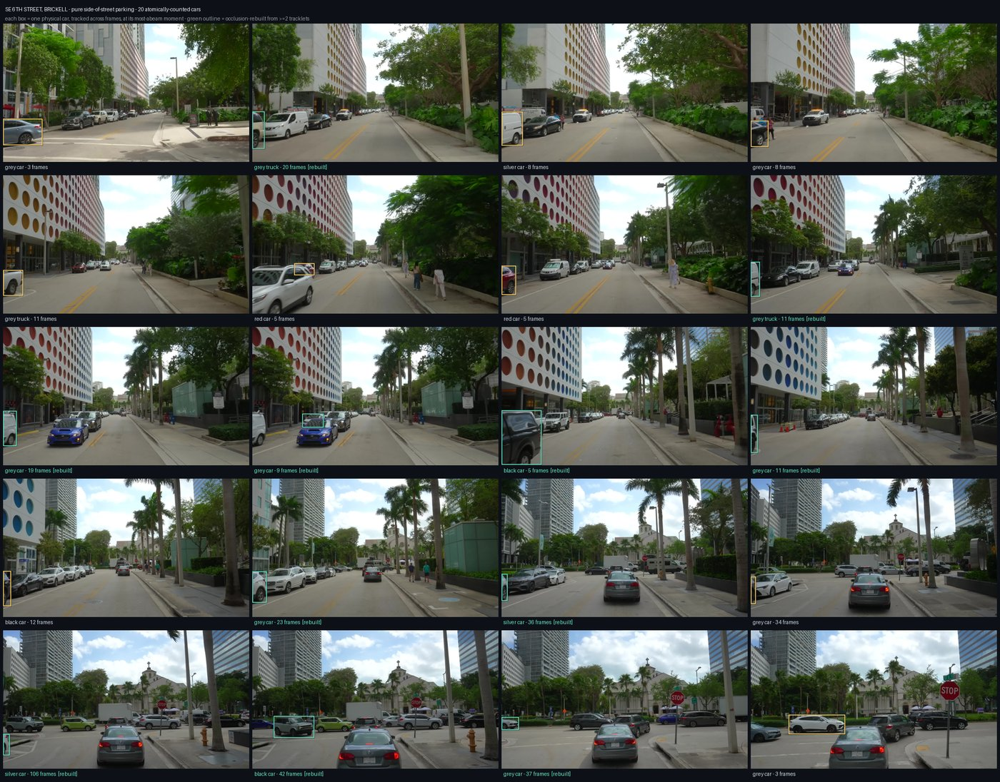
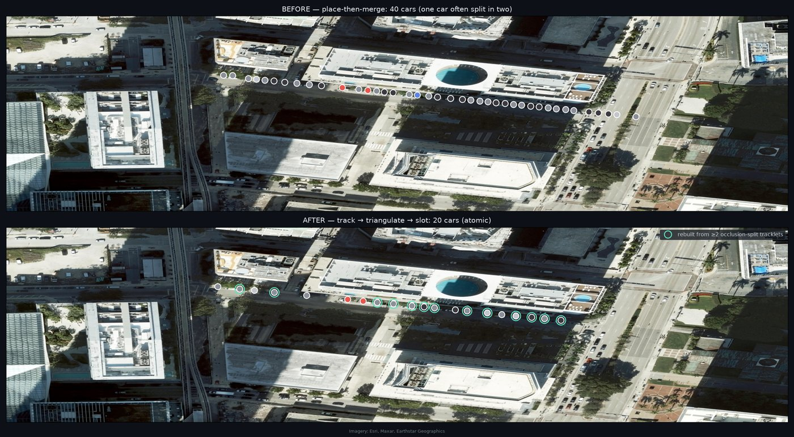
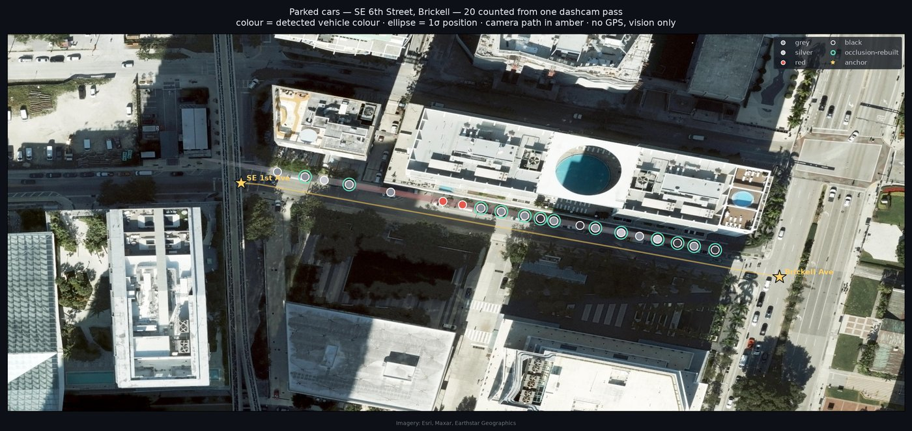
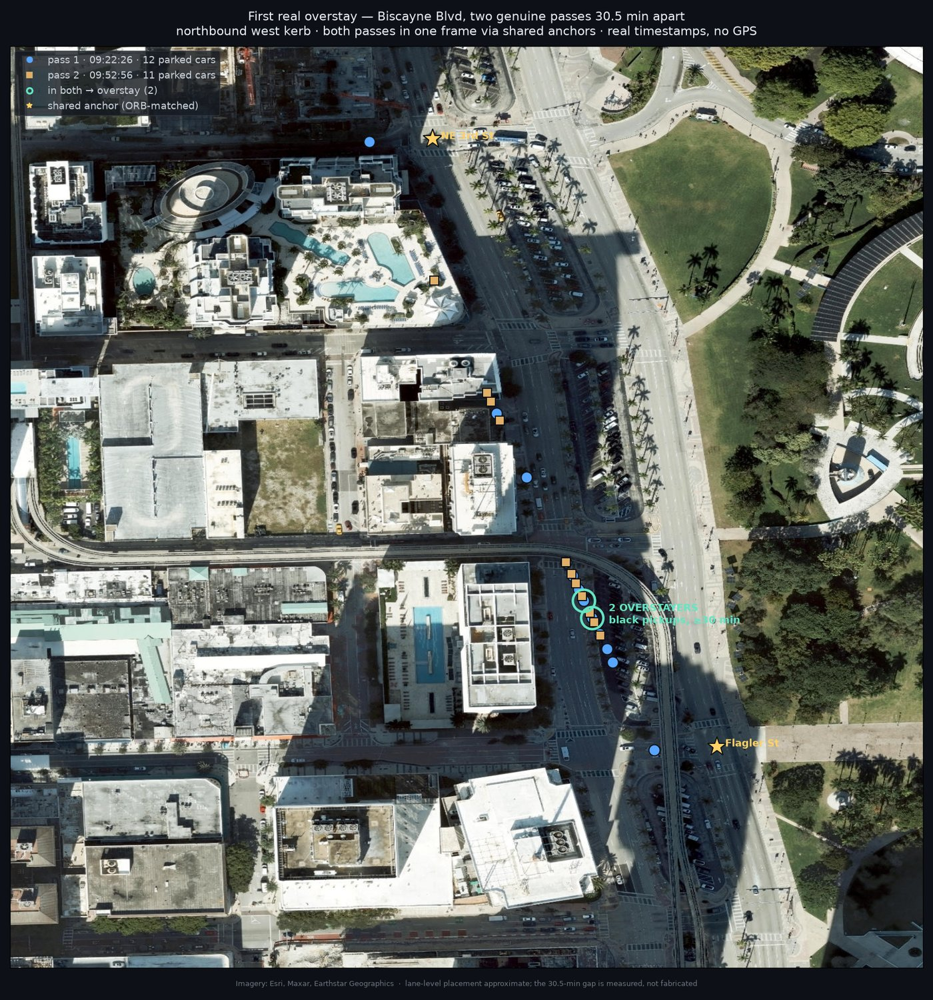
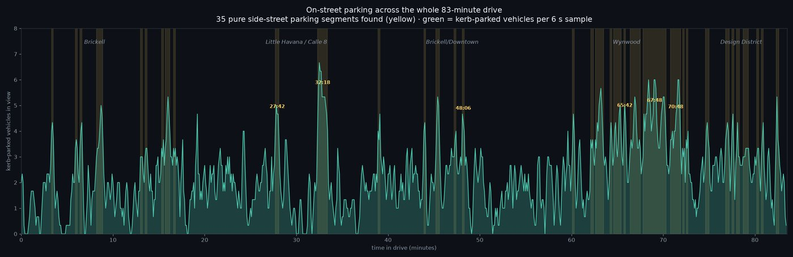

# carloc — plateless parking enforcement from dashcam video

Find parked cars from a moving camera, put each one on a map in real
latitude/longitude, decide whether it is sitting in a paid ParkMobile zone, and —
across two passes of the same street — tell which cars have **overstayed**.

All of that **without reading a licence plate**, and **without GPS**. Position
comes from the video itself plus public map data.

> This is a research demo built against one source: an 83-minute Miami driving
> tour (YouTube). It is honest about where it works and where it does not — see
> [Accuracy: where this works](#accuracy-where-this-works). The full running
> notebook of decisions and dead ends is in [`research/FINDINGS.md`](research/FINDINGS.md).



*20 parked cars on one Brickell block, each detected from the moving camera and
counted exactly once. [More below.](#results)*

---

## Why plateless

The enforcement question ParkMobile actually has is *"is this car a paying
customer or an evader?"* — and you do **not** need the plate to answer it, because
you can cross-reference a car's **location** against ParkMobile's own zone
database instead. That reframing is the whole project: read *where* a car is
accurately enough, and the plate becomes irrelevant. It also sidesteps the
privacy and legal weight of plate capture.

---

## The pipeline

```
 dashcam video
      │
      ▼
 ┌─────────────┐   RF-DETR, tiled at native resolution
 │  detect     │   COCO vehicle classes only, kerb-side (off-centre) boxes
 └─────────────┘   carloc/rfdetr_detect.py
      │
      ▼
 ┌─────────────┐   link detections of the same car across frames by image
 │  track      │   motion + appearance  →  one tracklet per physical car
 └─────────────┘   carloc/tracking.py :: associate()
      │
      ▼
 ┌─────────────┐   each car's along-street position from ALL its bearings:
 │ triangulate │   S = s_camera + L/tan(bearing), weighted by sin⁴(bearing)
 └─────────────┘   rejects vehicles moving with traffic  ·  tracking.py :: triangulate()
      │
      ▼
 ┌─────────────┐   collapse tracklets to physical cars, min-separation prior
 │  slot       │   (fixes occlusion-split double-counts)  ·  tracking.py :: slot()
 └─────────────┘
      │
      ▼
 ┌─────────────┐   place each car in lat/lon by anchoring the camera trajectory
 │  localise   │   to known points (street-name blades → OSM, or the block grid)
 └─────────────┘   carloc/dashcam.py, research/*_pipeline.py
      │
      ├────────────────────────┐
      ▼                        ▼
 ┌─────────────┐        ┌──────────────┐
 │ zone verdict│        │ sightings log│  (place, time, appearance, uncertainty)
 │ in a paid   │        │  + overstay  │  carloc/sightings.py
 │ ParkMobile  │        │  matching    │
 │ zone?       │        └──────────────┘
 └─────────────┘
 carloc/zonebox.py,
 carloc/parkmobile.py
```

Each stage is a small module with a single job. The sections below explain the
non-obvious ones.

---

## How it works, stage by stage

### 1. Detection — RF-DETR, not YOLO

`carloc/rfdetr_detect.py`. Overhead/oblique parked cars are a distribution a
COCO-trained CNN has barely seen; on nadir satellite tiles YOLO returns *"clock",
"train", "potted plant"*. RF-DETR (Apache-2.0, DETR architecture) generalises to
that geometry. Images are **tiled at native resolution** so a car arrives at the
size the network was trained to see. Only COCO vehicle classes are kept, and only
boxes off-centre and low in the frame (a parallel-parked car projects there;
traffic ahead sits central and higher).

### 2. Appearance — colour without a paint chip

`carloc/appearance.py`. Because there is no plate, a car's identity across two
passes is carried by **class + coarse colour + position**. Colour is named in
HSV, not by RGB nearest-neighbour: below a saturation gate the car is *achromatic*
and named by brightness (black/grey/silver/white); only a genuinely saturated car
reads a hue. This fixed an early bug where dark cars in shade — a trace of
blue-green from the sky — were being called *green*.

### 3. Tracking + triangulation — one car, counted once

`carloc/tracking.py`. Placing every detection independently and merging nearby
points **over-counts**: one car, seen across many frames as the camera passes, has
a bearing that sweeps, and a single-frame range estimate is unstable at shallow
angles, so it scatters and splits. The fix treats a parked car as a **fixed world
point**:

- **`associate()`** links detections across frames into one tracklet per car by
  image motion (a kerb car drifts left and grows) plus appearance.
- **`triangulate()`** solves each car's along-street position from *all* its
  bearings at once — `S = s_cam + L/tan(bearing)`, weighted by `sin⁴(bearing)` so
  the near-abeam views (precise) dominate the far ones (useless). A tracklet whose
  `S` climbs with the camera is a vehicle **moving with traffic** and is rejected.
- **`slot()`** collapses tracklets to physical cars with a minimum-separation
  prior, so an obstruction that split one car into two tracklets doesn't become
  two phantom cars.

On a clean block this took a naive count of 40 down to an **atomic 20**.



### 4. Localisation — the hard part, no GPS

The camera's own trajectory is reconstructed from the video (`carloc/dashcam.py`):
**yaw** (turn signature) survives easily because a camera rotation shifts the whole
image; **speed** comes from *residual scene motion* (parallax against buildings and
parked cars) because the road tarmac itself has no trackable texture. That gives a
*relative* trajectory. To make it absolute you need **anchors**:

- **Street-name blades** — read off the 4K video by eye, looked up in
  OpenStreetMap, and used to pin the trajectory ends. Metre-accurate. Works on
  arterials (SE 1st Ave, Flagler, NE 3rd…).
- **The block grid** — where a street has no blades, the **gaps in the parked-car
  row are the intersections**; aligning that pattern to OSM's known cross-street
  spacing recovers scale and relative structure for free (`research/` Wynwood
  patch). Gets you correct spacing and which-block, with a residual ±1-block
  offset the periodic grid can't break on its own.

### 5. ParkMobile zones — the verdict

`carloc/parkmobile.py` reaches the on-street zone geometry through the endpoints
ParkMobile's own web app uses (the public search box is a Google geocoder and a
dead end; the real chain is `zones/{code}` → `internalZoneCode` →
`locations?...`). `carloc/zonebox.py` turns a zone into parking-lane polygons and
returns a three-way verdict — **INSIDE / OUTSIDE / AMBIGUOUS** — with a signed
margin against the position uncertainty. The lane band (distance from the street
centreline where cars actually park) was **measured** from 185 observed cars at
4.73 m, not assumed. Zones that are mostly residential are flagged
`likely_permit`, because plateless enforcement can't separate a resident from a
violator there.

### 6. Sightings + overstay

`carloc/sightings.py`. Every placed car becomes one **sighting**:
`(lat/lon, timestamp, class+colour, position uncertainty)`. The presence query
—*"was a car here?"*— is a **Mahalanobis gate**, not a radius, because a fix here
is tight across the street (~1.8 m) and loose along it (metres), so an isotropic
circle is wrong on both axes. Overstay is then two sightings that are the same car
(appearance + position) far apart in time, matched **one-to-one mutual-nearest** to
avoid linking every grey car to every other. On a synthetic second pass this
recovered 20 of 23 loiterers with **zero false positives** — the property that
matters, since you never want to flag a paying parker.

---

## Results

| what | where | result |
|---|---|---|
| Atomic count, clean block | SE 6th St, Brickell | **20 parked cars**, metre-accurate, blade-anchored |
| First **real** overstay | Biscayne Blvd, two passes 30.5 min apart | 12 vs 11 cars, matched; the same block re-driven half an hour later |
| Whole-video parking survey | all 83 min | **35 pure side-street parking segments** found (Wynwood, Little Havana, Brickell) |
| Dense neighbourhood map | NW 2nd Ave, Wynwood | **45 cars, both kerbs**, grid-locked to NW 22nd–29th St |
| Public-camera overlap | Miami-Dade | **1 of 383** FDOT cameras within 150 m of a paid kerb — and it's a highway |


*The count, mapped: each car in real lat/lon along the kerb, coloured by detected colour.*


*Overstay on real data: the same block driven twice, 30 minutes apart, cars in both passes flagged.*


*The whole-video survey: where the drive passes parkable kerb, across all 83 minutes.*

Every map exports to **KML** (`carloc/export.py`) for Google My Maps / Earth, with
named `latitude`/`longitude` columns to defeat the GeoJSON axis-order trap that
otherwise silently sends Miami coordinates to Antarctica.

---

## Accuracy: where this works

The vision (detect, count, colour, both-kerb structure) is solid everywhere. The
**localisation** accuracy is entirely a function of what anchors the street offers:

| block type | example | along-track error |
|---|---|---|
| has street-name blades | SE 6th, Biscayne arterials | **~metres** (lands on individual spots) |
| bare grid, no blades | Wynwood side streets | **scale correct** (grid-locked), **±1 block** absolute offset |
| no anchors at all | — | relative only |

The single thing that collapses all of this to metre-accuracy everywhere is a
**GPS track on the capture vehicle** — the boring answer a real deployment would
use. Everything here is what you can squeeze out of the pixels *without* it.

Things that were tried and **did not** pan out, documented honestly rather than
hidden: drone-altitude imagery can't do per-car resolution; public traffic cameras
don't overlook parking; and matching video frames to Mapillary/Street View imagery
(ORB, SIFT, and learned LoFTR) does **not** lock on in fast-changing Wynwood
(best 17 geometric inliers, noise-level) — the method is sound but needs stable,
same-direction coverage.

---

## Repository layout

```
carloc/                library modules
  rfdetr_detect.py     RF-DETR vehicle detection, tiled
  appearance.py        HSV colour classification (the re-id key)
  tracking.py          associate → triangulate → slot  (atomic counting)
  dashcam.py           yaw + scene-motion odometry
  sightings.py         sightings log, Mahalanobis presence query, overstay
  parkmobile.py        ParkMobile on-street zone API client
  zonebox.py           parking-lane polygons + INSIDE/OUTSIDE/AMBIGUOUS verdict
  basemap.py           georeferenced Esri satellite tiles (Web Mercator)
  export.py            KML / CSV / WKT export (axis-order-safe)
  downtown.py          demo scope + judging helpers
research/              per-experiment scripts (SE 6th, Biscayne, Wynwood, survey…)
  FINDINGS.md          the full decision log — read this for the real story
reports/               generated maps, overlays, CSV/KML (gitignored PNGs)
```

## Running it

Dependencies are managed with [`uv`](https://docs.astral.sh/uv/). The detector
needs the `detect` extra (RF-DETR, torch):

```bash
uv sync --extra detect --extra plot
```

Credentials (never committed; `.env` is gitignored):

- `ROBOFLOW_API_KEY` — not needed for RF-DETR (runs locally, no key)
- `MAPILLARY_TOKEN` — only for the (experimental) imagery-matching localisation
- ParkMobile zone endpoints need no key; requests are rate-limited by default

The `research/*.py` scripts are the entry points — each reconstructs one result
(e.g. `research/se6_count.py` produces the 20-car SE 6th count,
`research/parking_survey.py` the whole-video parking timeline). Outputs land in
`reports/`.

---

## Honest bottom line

The plateless idea works: you can detect kerb-side parked cars from a moving
camera, count them atomically, place them on a real map, check them against
ParkMobile's zone database, and catch overstays across two passes — all from the
video. Absolute position is metre-accurate where the street gives you an anchor
and block-level where it doesn't, and a GPS track closes that last gap everywhere.
The vision half is done; the localisation half is a solved problem the moment the
capture vehicle knows roughly where it is.
