# Geolocation evaluation

Generated by `geoloc-eval`. Every number below comes from synthetic sessions with injected noise, scored against exact ground truth.

## Read this first

Two results matter more than the accuracy table, because both are cases where the system is wrong:

2. **A constant heading bias defeats the covariance.** With a 2-degree yaw error the median error is 1.495 m while mean NEES reaches 15132 against a nominal 3. The filter is not merely wrong, it is *confidently* wrong, because a constant bias is unobservable to a filter that models only zero-mean noise. No amount of covariance bookkeeping fixes this; it needs an independent heading reference or an observability-aware calibration step.

## Scenarios

Accuracy is reported over **confirmed** tracks only. Tentative tracks are internal filter state that never reaches an operator. Errors are split by geometry class derived from *ground truth* rather than from the system's own degeneracy flag, so the flag can be scored rather than assumed.

| scenario | tracks | good / degen | median good (m) | p90 good (m) | RMSE good (m) | median degen (m) | mean NEES | calibrated | gross err | purity |
|---|---|---|---|---|---|---|---|---|---|---|
| `clean_lateral` | 66 | 66 / 0 | 0.047 | 0.151 | 0.237 | -- | 4.64 | no | 0.000 | 0.995 |
| `forward_motion` | 65 | 61 / 4 | 1.221 | 5.170 | 3.654 | 7.181 | 3.76 | no | 0.169 | 1.000 |
| `arc_sweep` | 43 | 43 / 0 | 0.073 | 0.250 | 0.216 | -- | 5.46 | no | 0.000 | 1.000 |
| `gps_degraded` | 70 | 57 / 13 | 11.325 | 27.544 | 18.825 | 22.446 | 20.47 | no | 0.886 | 0.830 |
| `heading_bias` | 71 | 71 / 0 | 1.495 | 1.783 | 1.492 | -- | 15132.05 | no | 0.000 | 0.996 |
| `cluttered` | 65 | 65 / 0 | 0.049 | 0.188 | 0.459 | -- | 4.39 | no | 0.000 | 0.997 |
| `with_ranger` | 67 | 67 / 0 | 0.059 | 0.213 | 0.240 | -- | 7.44 | no | 0.000 | 0.995 |

`RMSE good` sits well above `median good` throughout. That gap is the point: the error distribution is heavy-tailed, so RMSE alone would misrepresent both typical accuracy and worst-case behaviour. `gross err` is the fraction of confirmed tracks beyond 5 m.

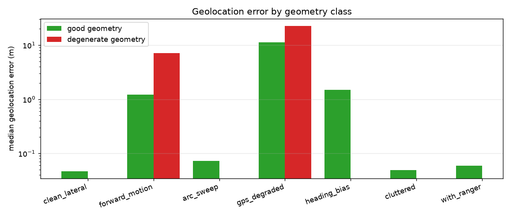

## Degenerate-geometry detection

Scored as a detector. Ground truth for 'degenerate' is the fractional range uncertainty the geometry actually supports, `sqrt(2) R sigma_theta / B_perp`, computed from the true object position and the real camera centres.

| scenario | recall | precision | truly degenerate |
|---|---|---|---|
| `clean_lateral` | -- | -- | 0 |
| `forward_motion` | 1.00 | 0.09 | 4 |
| `arc_sweep` | -- | 0.00 | 0 |
| `gps_degraded` | 0.77 | 0.67 | 13 |
| `heading_bias` | -- | -- | 0 |
| `cluttered` | -- | -- | 0 |
| `with_ranger` | -- | -- | 0 |

## Filter calibration (NEES)

NEES is the normalised estimation error squared: `e^T P^-1 e` for error `e` and reported covariance `P`. For an honest 3-D filter it is chi-square with 3 degrees of freedom, so the mean should be 3. Above the band means overconfident -- the system claims more precision than it has, which is the dangerous direction. Below means it is discarding information.

| scenario | mean NEES | median | 95% band | verdict |
|---|---|---|---|---|
| `clean_lateral` | 4.64 | 2.70 | [2.44, 3.62] | overconfident |
| `forward_motion` | 3.76 | 2.70 | [2.42, 3.65] | overconfident |
| `arc_sweep` | 5.46 | 4.36 | [2.31, 3.78] | overconfident |
| `gps_degraded` | 20.47 | 15.50 | [2.40, 3.67] | overconfident |
| `heading_bias` | 15132.05 | 19751.33 | [2.46, 3.60] | overconfident |
| `cluttered` | 4.39 | 2.46 | [2.43, 3.62] | overconfident |
| `with_ranger` | 7.44 | 5.45 | [2.44, 3.61] | overconfident |

## Error vs injected noise

### `bearing_noise` — bearing_sigma

| bearing_sigma | median good (m) | p90 (m) | RMSE (m) | mean NEES | calibrated | tracks |
|---|---|---|---|---|---|---|
| 0.0 | 0.000 | 0.000 | 0.000 | 0.00 | no | 36 |
| 0.0008 | 0.017 | 0.046 | 0.029 | 0.76 | no | 36 |
| 0.00158 | 0.047 | 0.354 | 0.293 | 4.34 | no | 40 |
| 0.003 | 0.249 | 2.097 | 3.342 | 35.97 | no | 67 |
| 0.006 | 2.131 | 16.969 | 9.003 | 191.51 | no | 64 |
| 0.012 | 8.097 | 16.762 | 12.210 | 1303.27 | no | 31 |

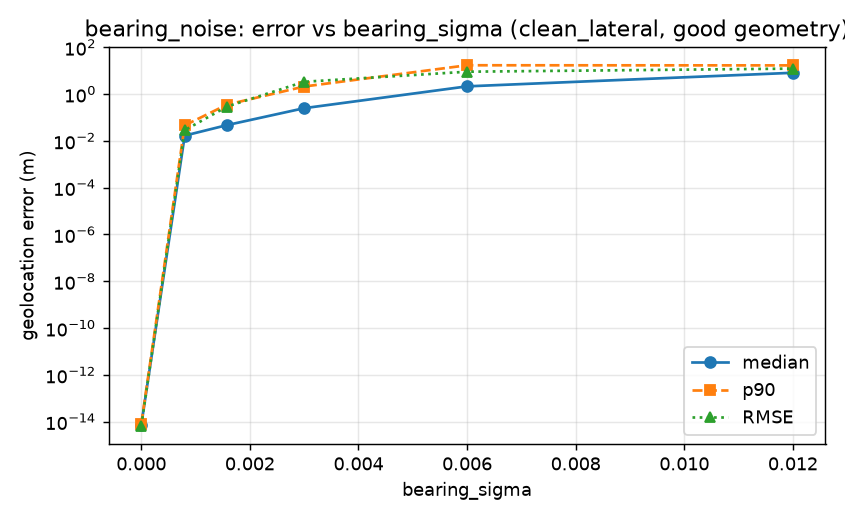
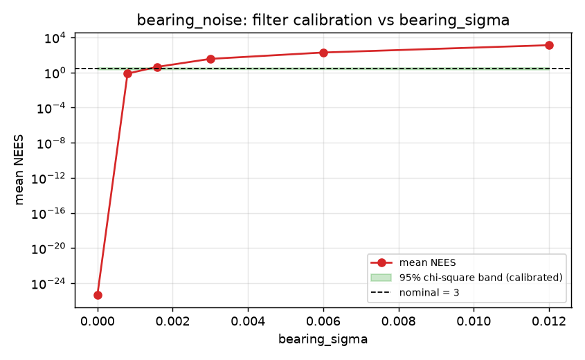

### `gps_noise` — gps_sigma

| gps_sigma | median good (m) | p90 (m) | RMSE (m) | mean NEES | calibrated | tracks |
|---|---|---|---|---|---|---|
| 0.0 | 0.047 | 0.354 | 0.293 | 4.34 | no | 40 |
| 0.5 | 0.966 | 2.579 | 1.804 | 8.88 | no | 42 |
| 1.0 | 4.016 | 6.358 | 5.227 | 11.69 | no | 39 |
| 2.0 | 12.182 | 35.461 | 20.987 | 21.07 | no | 34 |
| 5.0 | 45.030 | 131.541 | 77.545 | 32.04 | no | 8 |
| 10.0 | -- | -- | -- | -- | no | 0 |

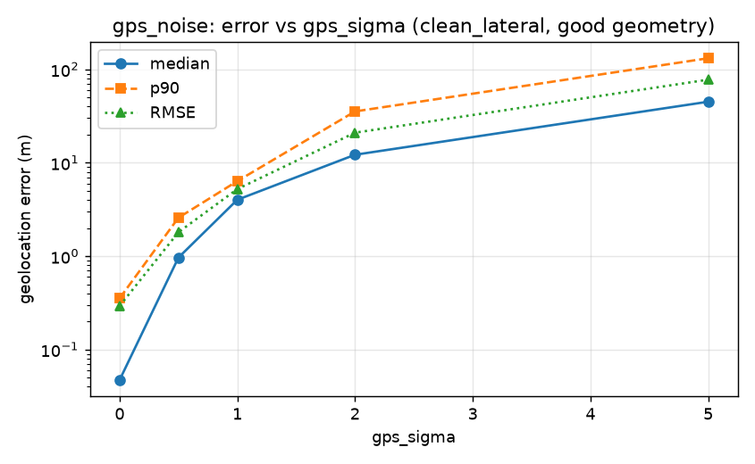
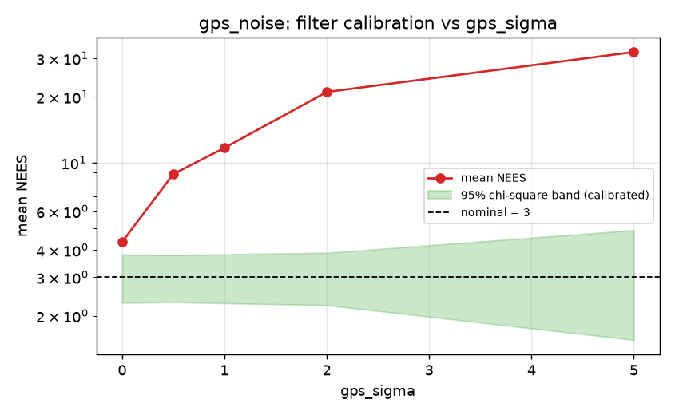

### `heading_bias` — heading_bias

| heading_bias | median good (m) | p90 (m) | RMSE (m) | mean NEES | calibrated | tracks |
|---|---|---|---|---|---|---|
| 0.0 | 0.047 | 0.354 | 0.293 | 4.34 | no | 40 |
| 0.0087 | 0.384 | 0.525 | 0.485 | 1166.11 | no | 41 |
| 0.0175 | 0.756 | 0.906 | 0.793 | 4373.97 | no | 41 |
| 0.0349 | 1.490 | 1.766 | 1.478 | 15439.41 | no | 40 |
| 0.0698 | 3.010 | 3.603 | 3.314 | 49731.47 | no | 44 |

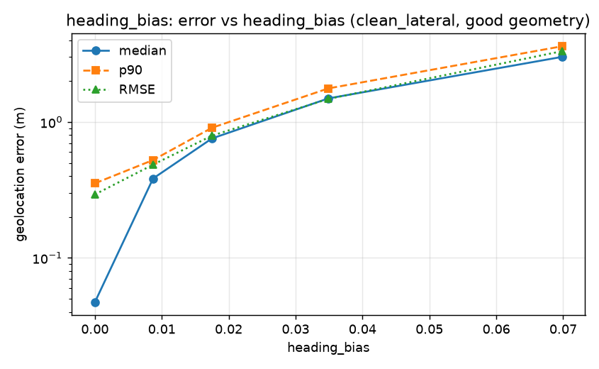
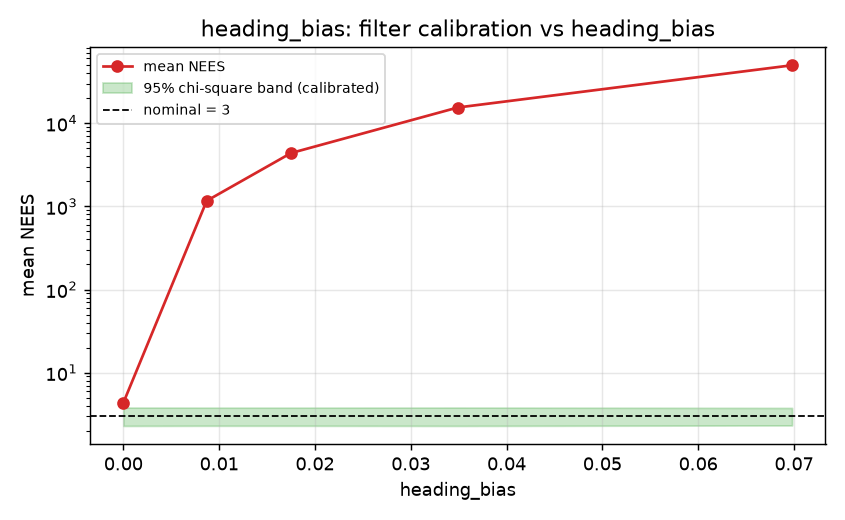

### `heading_noise` — heading_sigma

| heading_sigma | median good (m) | p90 (m) | RMSE (m) | mean NEES | calibrated | tracks |
|---|---|---|---|---|---|---|
| 0.0 | 0.047 | 0.354 | 0.293 | 4.34 | no | 40 |
| 0.0044 | 0.180 | 0.546 | 4.542 | 36.54 | no | 39 |
| 0.0087 | 0.428 | 1.094 | 3.538 | 149.43 | no | 40 |
| 0.0175 | 0.588 | 3.998 | 6.238 | 725.03 | no | 40 |
| 0.0349 | 1.318 | 10.387 | 7.532 | 3952.18 | no | 42 |

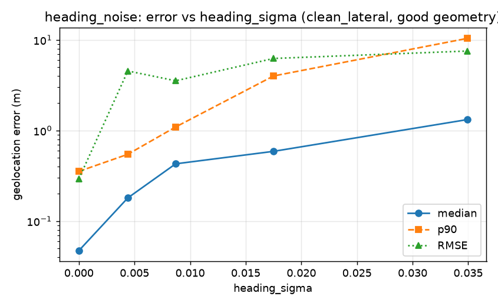
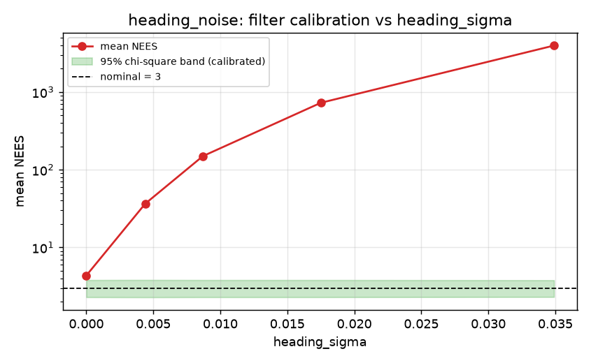

### `dropout` — detection_dropout

| detection_dropout | median good (m) | p90 (m) | RMSE (m) | mean NEES | calibrated | tracks |
|---|---|---|---|---|---|---|
| 0.0 | 0.047 | 0.354 | 0.293 | 4.34 | no | 40 |
| 0.1 | 0.042 | 0.186 | 0.378 | 3.93 | no | 38 |
| 0.25 | 0.047 | 0.209 | 0.181 | 5.13 | no | 38 |
| 0.5 | 0.083 | 0.379 | 0.296 | 3.75 | yes | 32 |
| 0.75 | 0.387 | 1.987 | 1.729 | 3.45 | yes | 17 |

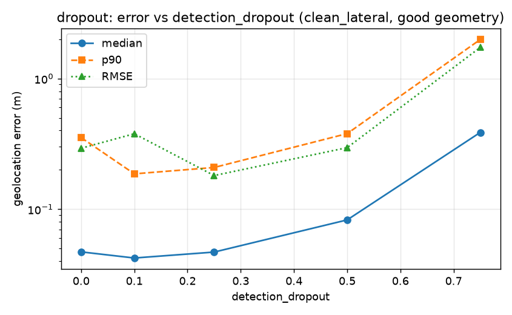
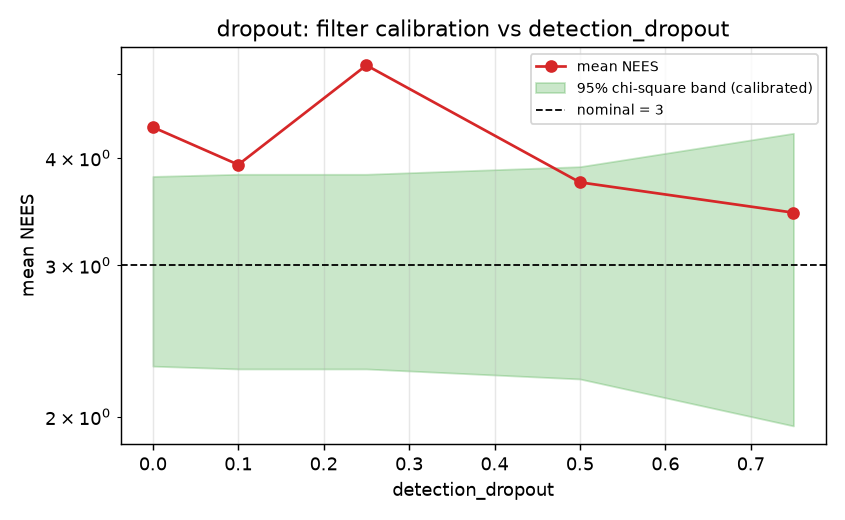

### `false_positives` — false_positive_rate

| false_positive_rate | median good (m) | p90 (m) | RMSE (m) | mean NEES | calibrated | tracks |
|---|---|---|---|---|---|---|
| 0.0 | 0.047 | 0.354 | 0.293 | 4.34 | no | 40 |
| 0.25 | 0.048 | 0.306 | 0.958 | 3.90 | no | 38 |
| 0.5 | 0.045 | 0.147 | 0.440 | 4.59 | no | 37 |
| 1.0 | 0.044 | 0.198 | 0.305 | 5.01 | no | 40 |
| 2.0 | 0.050 | 0.148 | 2.921 | 305.66 | no | 39 |

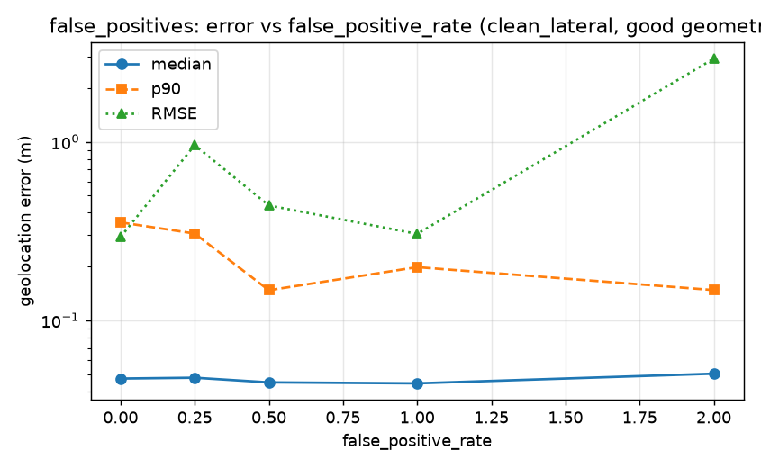
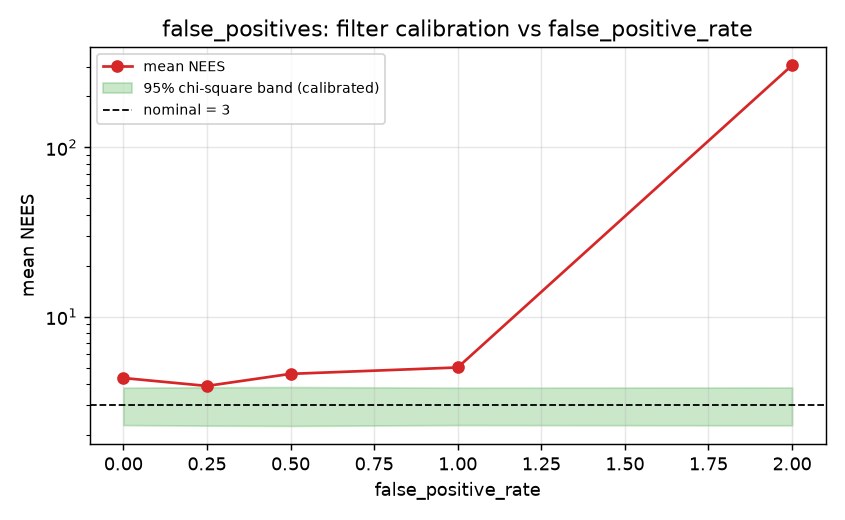

## Limitations

- **Bounding-box centroid drift.** Bearings are taken through the centroid of a 2-D box, which is not the centroid of the 3-D object and moves with viewing aspect. This is a bias, not noise, so it does not average out over a track and is not represented in the covariance.
- **Degenerate geometry under forward motion.** The common vehicle case is the bad case. It is detected and reported, not solved.
- **Constant heading bias is invisible to the filter.** See above. It needs an external reference.
- **Linearised covariance is local.** For short tracks on small baselines the covariance is computed about an estimate that may itself be badly wrong, so it can be small and wrong together. Mitigated by refusing to confirm tracks below a minimum observation count and perpendicular baseline; not eliminated.
- **Synthetic data only.** These numbers come from a geometric simulator with a perfect detector. They isolate geometry and filter error, which is what they are for, but they are an upper bound on real-world performance.
- **nuScenes poses are map-local, not WGS84.** When that loader is used, any lat/lon emitted is relative to an assumed map-region origin and is accurate relatively, not absolutely.
